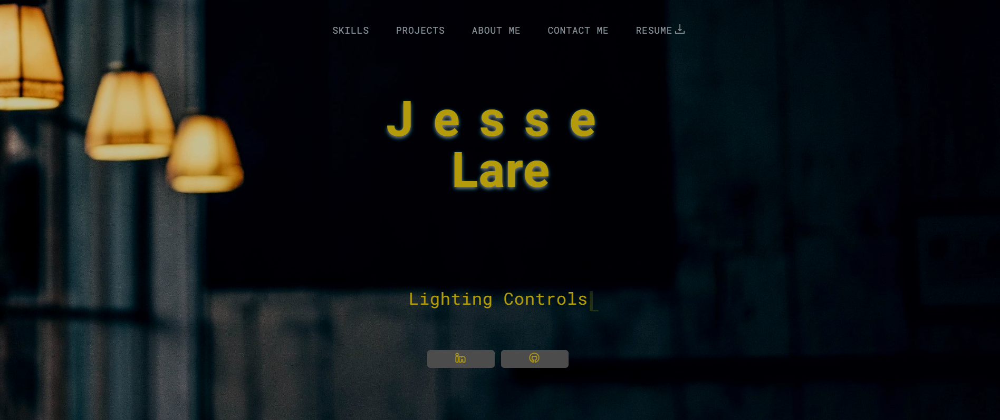

# Jesse Lare's React Portfolio

[Link to my deployed react portfolio](https://jl-react-portfolio.netlify.app/)

## Description

My React portfolio for my UCF Web Development Bootamp. This React portfolio was started using a template (see acknowledgments section), however, there were several files refactored. React/JavaScript as well as all styling was updated. Below is a breakdown of the refactoring.

Several components, including "Achievments.jsx", "Projects.jsx", and "AboutMe.jsx" were refactored. The main goal of this refactoring was to enhance code readability, maintainability, and component reusability. Below is an overview of the key changes made and the reasons behind them:

Achievement.jsx & Projects.jsx
1. Extracted subcomponents: By breaking down complex components into smaller subcomponents, the code becomes easier to understand and manage. Functionalities that were responsible for rendering specific parts of the UI were extracted into their own components. For instance, in "Projects.jsx", each project's display logic was moved to a "ProjectCard" subcomponent.

2. Optimized rendering: To improve performance and prevent unnecessary re-renders. The use of React hooks and conditions was optimized to make sure components only rerender when necessary. This made it easier to read, understand, and maintain -- and makes it easier for devs to contribute.

AboutMe.jsx
1. Modularized content: Separating distinct sections of the component into different subcomponents enhances the modularity and readiblity of the code. The info and contact sections of the "AboutMe" component were split into "AboutMeInfo" and "AboutMeContact" subcomponents.

2. Enhanced code clarity: Clear and concise code is crucial for future maintenacnce and scalability of the app. The prop passing was streamlined, and the overal structure of the component was organized for better clarify.

## Features

- **Modern Single-Page Application:** Utilizing React Router for seamless navigation without page reloads.
- **Responsive Design:** Crafted to provide an optimal viewing experience across a wide range of devices.
- **Interactive UI:** Engaging user interface with attention to usability and aesthetic appeal.
- **Portfolio Section:** Showcasing projects with descriptions, images, and links to live sites and source code repositories.
- **Contact Form:** Used emailjs to set up contact submission form.
- **Professional About Section:** Detailed biography and professional avatar, highlighting my journey and expertise.
- **Dynamic Footer:** Links to professional profiles and additional resources.

## Technologies Used

- React 18
- Bootstrap 5
- React Router Dom
- Vite.js

## Deployment

This portfolio is deployed on Netlify, leveraging its CI/CD pipeline for automatic builds and deployments from the main branch.

## Acknowledgements

- React Template Files Used: [Pfrommer1982](https://github.com/Pfrommer1982/Complete_Portfolio)